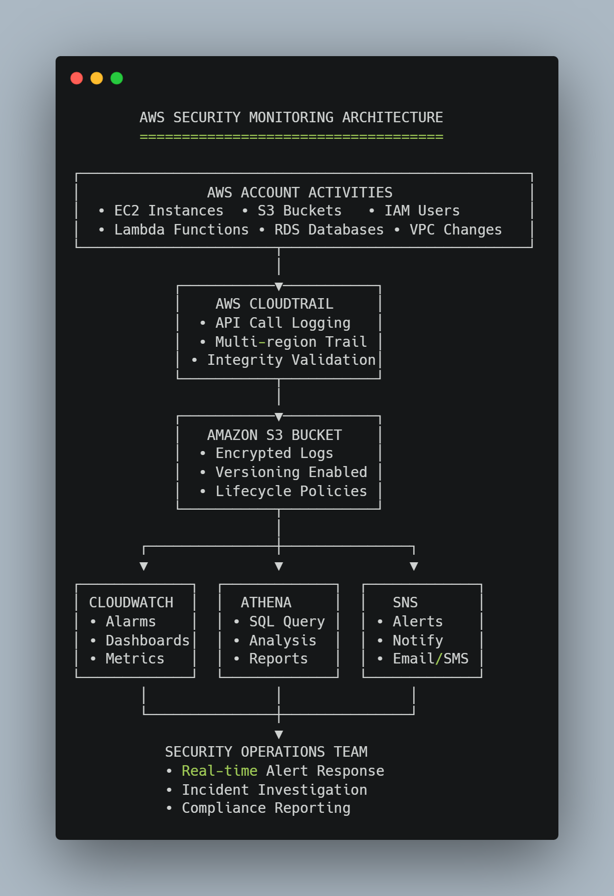
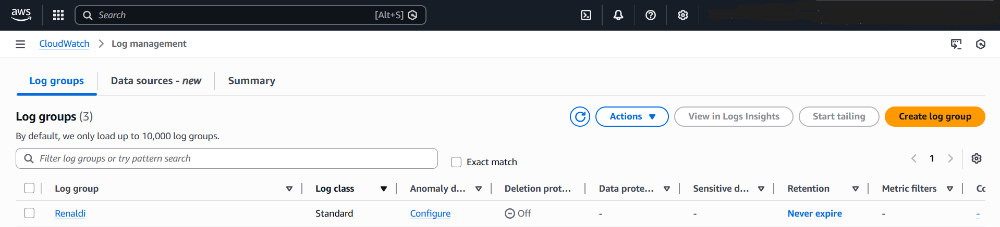

# 🔐 AWS Security Monitoring & Compliance Lab

## Overview
Implementation of comprehensive security monitoring using AWS native services for audit, compliance, and threat detection.

## 🎯 Objectives
- Monitor AWS resources and user activities in real-time
- Set up automated alerts for suspicious activities
- Create audit trails for compliance requirements
- Analyze logs for security insights

## 🏗️ Architecture

## 🔧 Technologies & Services
- **Amazon CloudWatch** (Metrics, Alarms, Dashboards)
- **AWS CloudTrail** (API activity logging)
- **Amazon Athena** (Log querying and analysis)
- **AWS IAM** (User activity tracking)
- **Amazon S3** (Log storage with encryption)
- **Amazon SNS** (Alert notifications)

## 📸 Monitoring & Security Implementation

### 1. CloudWatch Monitoring Suite

*Security alarms for anomalous activities and threshold violations.*

*Visualization of security metrics and performance monitoring.*

### 2. Log Management & Analysis

*Centralized log management with custom security log groups.*

*Custom log group `Renaldi` for security event streaming and analysis.*

### 3. Compliance & Configuration Management

*Resource inventory and compliance monitoring with managed rules.*

### 4. Audit Trail & Forensic Readiness

*CloudTrail log showing security event for forensic analysis and compliance auditing.*

## 📁 Repository Structure

## 🚀 Implementation

### 1. CloudWatch Monitoring Setup
- Created custom metrics for security events
- Configured alarms for:
  - Unauthorized API calls
  - Root account usage
  - Security group changes
  - IAM policy modifications
- Built CloudWatch dashboard for security overview

### 2. CloudTrail Configuration
- Enabled multi-region CloudTrail logging
- Configured log file validation (integrity checking)
- Set up S3 bucket with encryption for log storage
- Created Athena tables for SQL querying of CloudTrail logs

### 3. Alerting & Response
- Configured SNS topics for security alerts
- Implemented Lambda functions for automated response
- Created runbooks for common security incidents

## 🔐 Security Monitoring Rules Implemented
| Rule | Service | Purpose |
|------|---------|---------|
| Root Account Usage | CloudTrail | Alert on root account activity |
| IAM Policy Changes | CloudTrail | Track permission modifications |
| Security Group Changes | CloudTrail | Monitor network access changes |
| Failed Logins | CloudTrail | Detect brute force attempts |
| Unusual API Activity | CloudWatch | Anomaly detection |

## Security Analysis Capabilities
- **Failed Login Detection:** Query for unauthorized access attempts
- **IAM Policy Audit:** Monitor permission changes and role modifications  
- **Compliance Reporting:** Generate audit trails for security reviews

## Implementation Proof Summary

### ✅ Completed Components
1. **CloudWatch Logs** - Custom log group `Renaldi` with security event streaming
2. **CloudWatch Alarms** - 404Errors alarm with SNS notification integration
3. **AWS Config** - Compliance monitoring with managed rules
4. **CloudTrail** - API activity logging with multi-region trail
5. **S3 Encryption** - Secure log storage for audit trails

## 📸 Implementation Proof
View configuration screenshots in the [screenshots/](screenshots/) folder.

### 📊 Metrics & Coverage
- **Resources Monitored:** 22+ AWS resources
- **Compliance Rules:** 2 managed rules active
- **Log Retention:** Custom log groups with retention policies
- **Alert Coverage:** Real-time notifications for security events

### 🔐 Security Value Delivered
- **Visibility:** Full-stack monitoring from infrastructure to application logs
- **Compliance:** Automated checks against security best practices
- **Detection:** Real-time alerting for anomalous activities
- **Audit:** Immutable log trail for forensic investigation

---

## 👨‍💻 About the Author
**Renaldi** | Cloud Security Learner  
[GitHub Profile](https://github.com/Silentveil)

